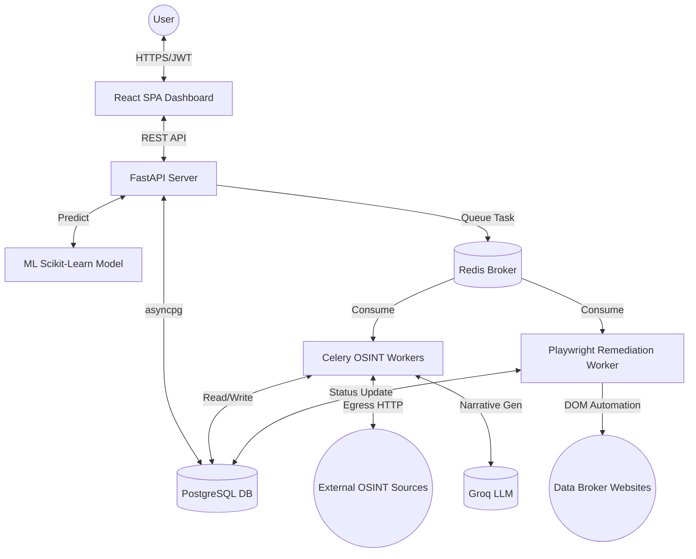

# DigiZafe 🛡️

DigiZafe is an integrated cybersecurity and privacy platform that acts as a secure search engine and robotic legal assistant. It discovers where a user's personal data is exposed online, assesses the risk of that exposure using machine learning, and utilizes headless browser automation to execute automated data removal (opt-out) requests against malicious data brokers.

## 🚀 Key Features

* **Discovery**: Safely orchestrates asynchronous, distributed OSINT processing across surface, deep, and dark web endpoints.
* **Correlation**: Deterministically correlates disparate, unstructured findings back to a single verified user identity using a rule-based match engine.
* **Remediation**: Automates PII takedowns by navigating obfuscated DOMs and anti-bot measures using Playwright.
* **Risk Scoring**: Uses a Scikit-Learn `HistGradientBoostingRegressor` to score user risk.
* **Generative Narratives**: Utilizes the Groq LLM API to generate human-readable privacy impact narratives.
* **Privacy & Security**: Built on a zero-trust architecture with strict egress controls, AES-GCM-256 envelope encryption, and PostgreSQL Row-Level Security (RLS).

## 🛠️ Technology Stack

| Layer | Technology |
|-------|------------|
| **Frontend** | React 18, Vite, Zustand, TailwindCSS |
| **Backend API** | Python 3.11, FastAPI, Uvicorn |
| **Database** | PostgreSQL 16, asyncpg, SQLAlchemy |
| **Cache/Queue** | Redis, Celery |
| **Remediation** | Playwright (Headless Chromium) |
| **Machine Learning**| Scikit-Learn (HistGradientBoostingRegressor) |
| **Generative AI** | Groq API |

## 🏗️ Architecture

DigiZafe follows a Domain-Driven Design (DDD) pattern, utilizing a stateless highly concurrent FastAPI backend, Celery workers for heavy OSINT processing, and a Playwright remediation engine. 



## 📂 Repository Structure

```text
DigiZafe/
├── backend/               # Python/FastAPI Application
├── frontend/              # React Application (Vite)
├── ml/                    # Machine Learning Pipeline & Models
├── shared/                # Static JSON catalogs and configuration
└── infrastructure/        # Deployment configurations (Docker, Redis)
```

## 🏁 Getting Started

### Prerequisites
- Docker and Docker Compose
- Node.js 20+ (for local frontend development)
- Python 3.11+ (for local backend development)

### Running with Docker (Recommended)

1. **Clone the repository:**
   ```bash
   git clone https://github.com/prudhvi1611/DigiZafe.git
   cd DigiZafe
   ```

2. **Configure Environment:**
   ```bash
   cp .env.example .env
   # Edit .env with your specific API keys (e.g., GROQ_API_KEY)
   ```

3. **Start the Infrastructure:**
   ```bash
   docker compose up -d postgres redis-broker redis-cache
   ```

4. **Start the Application Stack:**
   ```bash
   docker compose up -d api worker remediation-worker frontend
   ```

5. **Access the application:**
   - Frontend Dashboard: `http://localhost:5173`
   - Backend API Docs: `http://localhost:8000/docs`

## 🔒 Security Posture
DigiZafe employs robust mechanisms including:
- Short-lived JWTs paired with DB-backed Refresh Tokens.
- SSRF protection using a custom `EgressFetcher` resolving DNS with strict IP whitelists.
- Database-level isolation per tenant via Postgres RLS.
