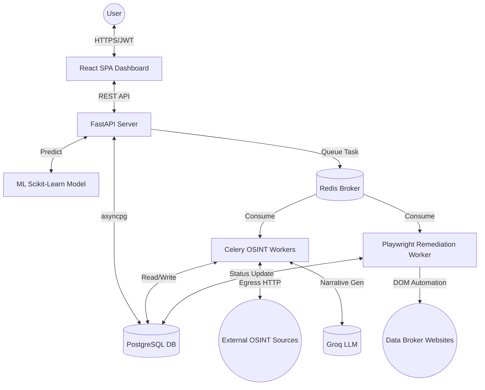
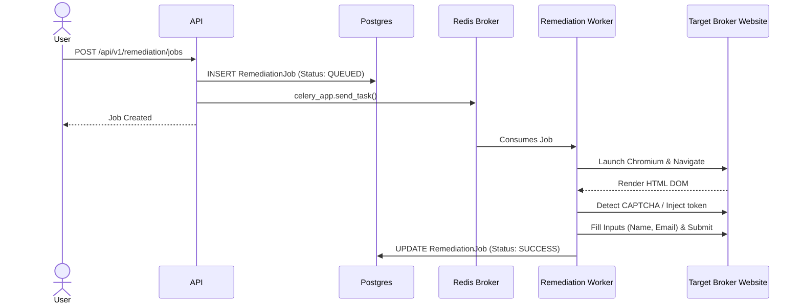

# DigiZafe: Master System Knowledge Base

This is the definitive technical source of truth for the DigiZafe platform, a Personal Digital Exposure Intelligence & Remediation Platform.

---

## 1. Executive Overview
DigiZafe is an integrated cybersecurity and privacy platform that acts as a secure search engine and robotic legal assistant. It discovers where a user's personal data is exposed online, assesses the risk of that exposure using machine learning, and utilizes headless browser automation to execute automated data removal (opt-out) requests against malicious data brokers. 

## 2. Problem Statement
Individuals lack visibility into where their personal data (PII) is sold or exposed. Even when discovered, manually opting out of hundreds of non-compliant data broker websites is a legally complex, technically obtuse, and highly repetitive task designed to frustrate human users.

## 3. Objectives
* **Discovery:** Safely orchestrate asynchronous, distributed OSINT processing across surface, deep, and dark web endpoints.
* **Correlation:** Deterministically correlate disparate, unstructured findings back to a single verified user identity.
* **Remediation:** Automate PII takedowns by navigating obfuscated DOMs and anti-bot measures.
* **Privacy:** Follow a zero-trust security architecture, with strict egress controls, robust cryptography, and database-level isolation.

---

## 4. Technology Stack

| Layer | Technology | Source File |
|-------|------------|-------------|
| **Frontend** | React 18, Vite, Zustand, TailwindCSS | `frontend/package.json` |
| **Backend API** | Python 3.11, FastAPI, Uvicorn | `pyproject.toml` |
| **Database** | PostgreSQL 16, asyncpg, SQLAlchemy | `docker-compose.yml`, `backend/app/models/` |
| **Cache/Queue** | Redis, Celery | `docker-compose.yml`, `backend/app/worker.py` |
| **Remediation** | Playwright (Headless Chromium) | `backend/app/remediation/runners/playwright_runner.py` |
| **Machine Learning**| Scikit-Learn (HistGradientBoostingRegressor) | `ml/training/train_residual.py` |
| **Generative AI** | Groq API | `backend/app/services/privacy/groq_client.py` |

---

## 5. Complete Architecture


*Source: Derived from `docker-compose.yml` and `backend/app/main.py` routing.*

---

## 6. Repository Structure

```text
DigiZafe/
├── backend/               # Python/FastAPI Application
│   ├── app/               # Core business logic, APIs, Models, Services
│   ├── tests/             # Pytest suite
│   └── alembic/           # Database migrations
├── frontend/              # React Application
│   ├── src/features/      # Domain-driven UI components
│   └── e2e/               # Playwright UI tests
├── ml/                    # Machine Learning Pipeline
│   ├── features/          # Feature engineering logic
│   └── models/            # Serialized .joblib models
├── shared/                # Static JSON catalogs and configuration
└── infrastructure/        # Deployment configurations (Docker, Redis config)
```

---

## 7. Component Architecture

* **Core API Server**: A stateless, highly concurrent HTTP interface relying on Pydantic validation and SQLAlchemy repositories.
  * *Source: `backend/app/main.py` -> `create_app()`*
* **OSINT Workers**: Background Celery processes that execute network-bound tasks against data sources, applying rate limits.
  * *Source: `backend/app/worker.py` -> `celery_app`*
* **Remediation Engine**: A specialized Celery worker constrained to `--concurrency=1` running Playwright scripts to emulate human DOM interactions.
  * *Source: `backend/app/remediation/runners/playwright_runner.py` -> `run_broker()`*
* **Predictive ML Engine**: An offline-trained Gradient Boosting regressor loaded dynamically to score user risk.
  * *Source: `backend/app/ml/residual_service.py`*

---

## 8. Complete Data Flow (Automated Remediation)



---

## 9. Frontend
* **Routing:** `react-router-dom` handles client-side routing, protected by auth guards.
* **State Management:** `Zustand` manages global state (like JWT presence), while `@tanstack/react-query` handles server state caching, invalidation, and polling.
* **Component Architecture:** Radix UI primitives wrapped in TailwindCSS, organized into `src/features` (e.g., `/features/privacy/`, `/features/scans/`).

---

## 10. Backend
* **Pattern:** Domain-Driven Design (Routers -> Dependencies -> Services -> Repositories -> Models).
* **Validation:** All inputs and outputs conform strictly to Pydantic v2 schemas (`backend/app/schemas/`).
* **Session Management:** Utilizes FastAPI's `Depends(get_db)` to yield an `AsyncSession`, ensuring transactional integrity per request.

---

## 11. APIs
RESTful routes defined under `/api/v1/*`.
* `/identity/*`: Correlates OSINT findings. Rebuilds the user graph.
* `/scans/*`: Triggers asynchronous discovery tasks in Celery.
* `/remediation/*`: Queues Playwright removal tasks and checks status.
* `/scores/*`: Retrieves ML residual risk and deterministic PDSS scores.
* *Source: `backend/app/api/v1/identity.py` -> `router.post("/graph/rebuild")`*

---

## 12. Database
* **Technology**: PostgreSQL 16 via SQLAlchemy and `asyncpg`.
* **Major Relationships**: The `User` is the root node. A User owns an `IdentityAnchor`. Scans produce `ObservationFinding` rows linked to the user. A `RemediationJob` operates on an `ObservationFinding`.
* **Flexibility**: OSINT data is incredibly diverse, so the raw finding data is stored in a `JSONB` column.
* *Source: `backend/app/models/observation_finding.py` -> `raw_data: Mapped[dict] = mapped_column(JSONB)`*

---

## 13. Algorithms (Deterministic Logic)
### Identity Match Engine
* **Algorithm**: Rule-based point correlation system.
* **Processing**: Scores independent evidence groups (Strong=70, Moderate=40). Caps usernames based on rarity to prevent false-positive collisions. Confirms matches if points > 70 with independent sources.
* **Explainability**: Mathematically maps logic back to localized strings so the user understands exactly *why* a finding was linked to them.
* *Source: `backend/app/services/identity_match_engine.py` -> `assess_candidate()`*

---

## 14. ML/AI
### Residual Risk Scoring
* **Model**: Scikit-Learn `HistGradientBoostingRegressor`.
* **Features**: Aggregations of finding severity, source diversity, and base scores.
* **Training**: Offline via tabular data (`residual-dataset.csv`), optimized for minimal latency.
* **Serialization**: Dumped to `residual-risk-v1.joblib` and checked via SHA256 hashes to prevent model tampering.
* *Source: `ml/training/train_residual.py` -> `model.fit(X, y)`*

### Generative Narratives (LLM)
* **Model**: Groq API (High-speed OpenAI-compatible inference).
* **Usage**: Generates non-deterministic, human-readable privacy impact narratives from raw JSON data. Strictly isolated from core matching math.
* *Source: `backend/app/services/privacy/groq_client.py` -> `groq_chat()`*

---

## 15. External Integrations
* **HaveIBeenPwned**: Credentials lookup using K-Anonymity (only sending SHA1 prefixes).
* **Common Crawl / Wayback**: Deep web archive scanning (Currently heavily mocked/stubbed to prevent system starvation).
* **Osintgram / Maigret**: Open-source intelligence scraping adapters.
* *Source: `backend/app/connectors/impl/surface/pwned_passwords.py`*

---

## 16. Security
* **Authentication**: Short-lived JWTs paired with DB-backed Refresh Tokens.
* **Encryption**: PII is protected via AES-GCM-256 envelope encryption, with HMAC-SHA256 blind indexing for database lookups.
  * *Source: `backend/app/security/keys.py` -> `KeyService.encrypt()`*
* **SSRF Protection**: Custom `EgressFetcher` intercepts all HTTP calls, resolves DNS first, and enforces strict IP whitelists (rejecting `169.254.x.x` metadata routes and private ranges).
  * *Source: `backend/app/security/egress.py` -> `_is_blocked_ip()`*
* **Authorization**: Postgres Row-Level Security (RLS) guarantees data isolation per tenant at the database engine level.

---

## 17. Background Processing
* **Engine**: Celery via Redis Broker.
* **Configuration**: Distributed queues (`celery`, `identity_enrichment`, `osint_connectors`). `task_acks_late=True` prevents task loss if a container OOMs.
* *Source: `backend/app/worker.py` -> `celery_app.conf`*

---

## 18. Caching
* **Storage**: Redis cache.
* **Purpose**: Saves network bandwidth and protects against vendor rate-limiting by caching third-party OSINT API responses via a TTL (Time To Live).

---

## 19. Testing
* **Unit/Integration**: Pytest testing algorithmic boundaries, RLS policies, and DB deduplication. Heavy use of `AsyncMock` to isolate third-party networking.
* **E2E**: Playwright tests (`frontend/e2e`) verifying the actual user UI journeys.
* *Source: `backend/tests/unit/test_rls_boundaries.py`*

---

## 20. Deployment
* **Orchestration**: Docker Compose running specialized profiles for the API, Brokers, Cache, Workers, Playwright Workers, and Frontend. 
* **Target State**: Fully containerized, meaning the platform can seamlessly migrate to Kubernetes (EKS/GKE).
* *Source: `docker-compose.yml`*

---

## 21. Performance
* **DB**: Utilizes `asyncpg` combined with GIN indexing on `JSONB` for ultra-fast document lookups inside a relational structure.
* **Concurrency**: `playwright_runner.py` is the ultimate system bottleneck due to Chromium's memory footprint. It is strictly limited to 1 concurrent task per container.

---

## 22. Error Handling
* **Data Brokers**: If Playwright fails a DOM interaction (e.g., due to an unsolvable CAPTCHA or site change), the system gracefully sets the Remediation status to `MANUAL_NEEDED` and alerts the user.
* **Outbound Connections**: Controlled by global HTTP timeouts in `EgressFetcher` to prevent Celery worker starvation.

---

## 23. Limitations
1. **Playwright Density**: Scaling automated takedowns requires massive cloud compute budgets because each job requires an isolated headless browser.
2. **DOM Brittleness**: Heuristic form filling relies on CSS selectors. If a broker changes their UI, the script breaks.
3. **Static ML**: The `HistGradientBoostingRegressor` cannot learn dynamically in production. It requires manual dataset intervention and retraining.

---

## 24. Design Decisions
* **Why FastAPI over Django?**: Massive async I/O requirements for OSINT scraping made FastAPI the superior choice.
* **Why Celery over AWS Lambda?**: Celery provides local cloud-agnostic execution for the MVP, though serverless scaling is the ideal target state for the Remediation engine.
* **Why Postgres over MongoDB?**: While OSINT data is JSON-like, mapping Identity Graphs securely requires strict ACID relational integrity and Row-Level Security.

---

## 25. Current vs Planned Features

| Feature | Current Status | Code Evidence | Test Evidence | Runtime Evidence |
|---------|----------------|---------------|---------------|------------------|
| Authentication & RLS | Implemented | `backend/app/security/jwt.py`, `alembic/versions/...` | `backend/tests/unit/test_auth.py` | Verified |
| Identity Correlation | Implemented | `backend/app/services/identity_match_engine.py` | `backend/tests/unit/test_identity...` | Verified |
| Surface Web OSINT | Implemented | `backend/app/connectors/impl/surface/` | `backend/tests/unit/connectors/...` | Verified |
| Automated Takedowns | Implemented (Heuristic) | `backend/app/remediation/runners/playwright_runner.py` | `frontend/e2e/...` | Best-effort |
| Deep Web OSINT | Mocked/Partial | `backend/app/connectors/impl/deep/` | `backend/tests/integration/...` (Mocked) | Not fully verified |
| Serverless Scaling | Planned | N/A | N/A | N/A |

---

## 26. Code-to-Concept Mapping

| Concept | Implementation File | Explanation |
|---------|---------------------|-------------|
| Takedown Engine | `backend/app/remediation/runners/playwright_runner.py` | Headless DOM interaction. |
| Identity Math | `backend/app/services/identity_match_engine.py` | Point-based matching algorithm. |
| SSRF Defense | `backend/app/security/egress.py` | DNS-first forced routing constraints. |
| Data Caching | `backend/app/worker.py` | Celery orchestration over Redis. |
| ML Prediction | `ml/training/train_residual.py` | `HistGradientBoostingRegressor` setup. |

---

## 27. Critical Files
1. `docker-compose.yml`: Outlines the entire system topology.
2. `backend/app/main.py`: The entry point and configuration injection for the API.
3. `backend/app/services/identity_match_engine.py`: The core algorithmic brain of the platform.
4. `backend/app/remediation/runners/playwright_runner.py`: The execution engine for the product's primary value proposition.
5. `backend/app/security/egress.py`: The system's primary defense mechanism against malicious outbound requests.

---

## 28. Unknown Areas
* **Browser CAPTCHA Thresholds**: It is unknown at what exact velocity Data Brokers will flag the Playwright IPs and implement blockades that bypass the `capsolver` integration.
* **LLM Output Stability**: While temperature is set low, Groq's exact response structure for novel, highly unusual data breaches cannot be 100% guaranteed. 
* **Real-world Database Scaling**: The performance degradation curve for `JSONB` GIN indexes as the row count approaches 100+ million `observation_findings` has not been empirically benchmarked.
