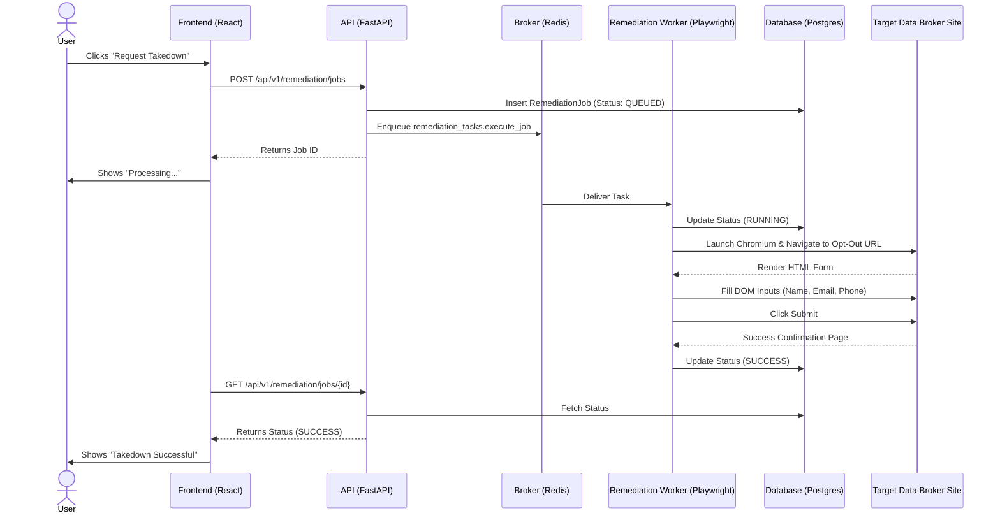
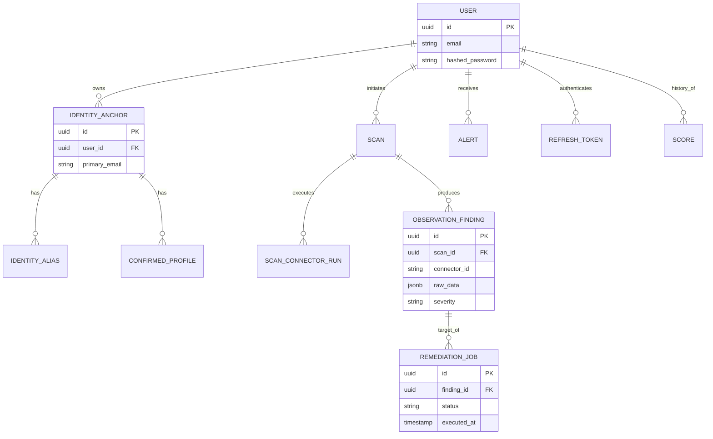

# DigiZafe: System Architecture & Data Flow

## 1. SYSTEM OVERVIEW

### Beginner Overview
DigiZafe is a "Personal Digital Exposure Intelligence & Remediation Platform." Imagine a highly secure search engine combined with a robotic legal assistant. You tell DigiZafe who you are (e.g., your email and phone number), and it scours the internet—including the surface web, deep web archives, and dark web data breaches—to find where your personal data is exposed. Once it finds exposed data, it doesn't just show you; it uses a robotic browser to automatically go to those websites, fill out privacy opt-out forms, and demand they take your data down.

### Technical Overview
DigiZafe is a distributed web application utilizing an asynchronous Python/FastAPI backend, a React/Vite Single Page Application (SPA) frontend, and a Celery-based worker architecture for distributed OSINT (Open Source Intelligence) gathering and automated web-automation-based remediation (via Playwright). It leverages machine learning (Scikit-Learn) to quantify personal data exposure into a "Residual Risk" score. Its core competency lies in orchestrating high-latency data discovery pipelines and stateful browser automation tasks while presenting a responsive, real-time dashboard to the end-user.

* **Users:** Individuals seeking to minimize their digital footprint.
* **Major Subsystems:**
  1. Frontend Dashboard (React)
  2. Core API Server (FastAPI)
  3. OSINT Discovery Workers (Celery)
  4. Automated Remediation Engine (Playwright)
  5. Machine Learning Risk Scorer (Scikit-Learn)

---

## 2. ARCHITECTURE DIAGRAM

```mermaid
flowchart TD
    %% User & External
    User((End User))
    TargetSites((Data Broker Websites))
    OSINTSources((OSINT APIs\nHIBP, crt.sh, etc.))
    GroqAPI((Groq LLM API))

    %% Frontend Layer
    subgraph Client [Frontend Layer]
        React[React Dashboard\n(Vite/Tailwind/Zustand)]
    end

    %% Backend API Layer
    subgraph Core [Backend API Layer]
        API[FastAPI Server]
        ML[ML Scoring Service\n(Scikit-Learn)]
    end

    %% Distributed Workers Layer
    subgraph Workers [Distributed Processing Layer]
        DiscoveryWorker[OSINT Discovery Workers\n(Celery)]
        RemediationWorker[Remediation Workers\n(Celery + Playwright)]
    end

    %% Storage Layer
    subgraph Data [Data & Storage Layer]
        PG[(PostgreSQL\nPrimary DB)]
        RedisCache[(Redis Cache)]
        RedisBroker[(Redis Message Broker)]
    end

    %% Connections
    User <-->|HTTPS / JWT| React
    React <-->|REST API| API
    
    API <-->|asyncpg| PG
    API <-->|Cache / Rate Limit| RedisCache
    API -->|Enqueue Task| RedisBroker
    API <-->|Feature Extraction| ML
    
    RedisBroker -->|Consume Task| DiscoveryWorker
    RedisBroker -->|Consume Task| RemediationWorker
    
    DiscoveryWorker <-->|CRUD Findings| PG
    DiscoveryWorker <-->|Network Requests| OSINTSources
    DiscoveryWorker <-->|Privacy Narratives| GroqAPI
    
    RemediationWorker <-->|Update Status| PG
    RemediationWorker -->|Headless Browser Action| TargetSites
```

### Connection Explanations:
* **Frontend ↔ API**: Stateless REST communication authenticated via JWTs.
* **API ↔ Postgres**: All application state, identity graphs, and findings are stored in Postgres using the asyncpg driver via SQLAlchemy.
* **API ↔ RedisCache**: Ephemeral storage for fast-access data (e.g., connector health status, rate limiting).
* **API ↔ RedisBroker**: The API pushes background tasks (like initiating a scan) into Redis.
* **Broker ↔ Workers**: Celery workers consume tasks from queues like `osint_connectors` and `celery`.
* **Discovery Worker ↔ OSINTSources**: Workers perform heavy network I/O, fetching data from third-party APIs.
* **Remediation Worker ↔ TargetSites**: Specialized workers launch headless Chromium (Playwright) to navigate to data broker sites and submit removal requests.
* **API ↔ ML**: The API loads `.joblib` serialized Scikit-learn models to calculate exposure scores dynamically.

---

## 3. COMPONENT ARCHITECTURE

### 3.1 Core API Server (`backend/app/main.py`)
* **Purpose**: Serve client requests, enforce auth/RBAC, and orchestrate the system.
* **Input**: HTTP REST requests.
* **Processing**: Validates via Pydantic, checks auth, performs DB CRUD via repositories, and delegates heavy tasks to Celery.
* **Output**: JSON HTTP responses.
* **Dependencies**: PostgreSQL, Redis, Scikit-Learn models.
* **Consumers**: React Frontend.

### 3.2 Discovery Workers (`backend/app/tasks/discovery_tasks.py`)
* **Purpose**: Asynchronously gather intelligence without blocking the web API.
* **Input**: Celery task payload (e.g., `scan_id`, `target_identifiers`).
* **Processing**: Iterates through an adapter registry (Surface, Deep web), executes network requests with rate limiting, parses results, and utilizes `identity_match_engine.py` to correlate findings.
* **Output**: Database rows in `observation_finding` and `alert` tables.
* **Dependencies**: External OSINT APIs, PostgreSQL.
* **Consumers**: Internal system (API reads what workers write).

### 3.3 Remediation Engine (`backend/app/remediation/runners/playwright_runner.py`)
* **Purpose**: Automate the complex process of data removal requests.
* **Input**: `remediation_job_id` indicating which target site to attack.
* **Processing**: Boots headless browser, navigates to target URL, finds DOM elements, fills out PII (Personal Identifiable Information), solves simple CAPTCHAs, and submits.
* **Output**: Status updates (`PENDING`, `SUCCESS`, `FAILED`) to the DB.
* **Dependencies**: Playwright, Target Websites.
* **Consumers**: The User (who monitors the status on the dashboard).

### 3.4 Predictive ML Engine (`backend/app/ml/residual_service.py`)
* **Purpose**: Calculate how "at-risk" a user is based on their digital footprint.
* **Input**: User Identity Graph vectors.
* **Processing**: Loads `residual-risk-v1.joblib` into memory, maps DB schemas to model features (`feature_adapter.py`), and executes inference.
* **Output**: Float risk score (e.g., 82.4).
* **Dependencies**: Scikit-Learn, Pandas.
* **Consumers**: API Server.

---

## 4. REQUEST LIFECYCLE (Trace: Initiating a Scan)

1. **User**: Clicks "Run Scan" on the Dashboard.
2. **Frontend**: Sends `POST /api/v1/scans` (React Query in `ScansPage.tsx`).
3. **API (Routing)**: `backend/app/api/v1/scans.py` receives the request.
4. **Validation (Deps)**: `CurrentUser` dependency validates the JWT. Payload validated via `schemas.scan.ScanCreate`.
5. **Service**: `ScanService.create_scan()` is called. It creates a `Scan` record in Postgres with status `PENDING`.
6. **Task Delegation**: `ScanService` calls `celery_app.send_task("app.tasks.discovery_tasks.run_scan", kwargs={"scan_id": scan.id})`.
7. **Response**: API returns `201 Created` with the `Scan` object.
8. **Frontend**: Receives response, updates UI to show "Scan In Progress", and begins polling `GET /api/v1/scans/{id}` (or SSE).
9. **Worker**: A Celery worker consumes the task, executes `run_scan()`.
10. **External Service**: Worker calls connectors (e.g., `github_connector.py`), gets JSON data.
11. **Database**: Worker normalizes findings and inserts into Postgres (`observation_finding`). Status changed to `COMPLETED`.
12. **Frontend**: Next poll fetches the completed scan and renders findings.

---

## 5. MAJOR FEATURE FLOWS

### Feature Flow: Automated Remediation



---

## 6. DATABASE ARCHITECTURE



### Major Relationships:
* **User is the root**: Almost all data cascades from the User via Row-Level Security (RLS) contexts.
* **Identity Anchor**: Represents the verified "ground truth" of a person. Aliases (like old usernames) hang off this anchor.
* **Scans & Findings**: A Scan is a point-in-time event. It produces many Findings.
* **Findings & Remediation**: A Remediation Job operates *on* a specific Finding (e.g., removing a discovered phone number from Whitepages).

---

## 7. FRONTEND ARCHITECTURE

* **Framework**: React 18, Vite.
* **Routing**: `react-router-dom` defined in `src/app/router.tsx`. Includes `ProtectedRoute` wrappers for authenticated sessions.
* **State Management**:
  * **Global State**: `zustand` (e.g., `auth-store.ts` for JWT handling).
  * **Server State**: `@tanstack/react-query` for fetching, caching, and polling API data seamlessly.
* **Components & Styling**: Tailwind CSS combined with Radix UI primitives (`@radix-ui/react-*`), structured in `src/components/ui/` as highly reusable, accessible components.
* **Visualization**: `recharts` for metrics, `cytoscape` for interactive Identity Graph visualization.
* **Feature Modularity**: Organized by domain in `src/features/` (e.g., `auth/`, `dashboard/`, `privacy/`, `scans/`).

---

## 8. BACKEND ARCHITECTURE

The backend follows a domain-driven, layered architectural pattern within the FastAPI framework.

* **API Routing (`app/api/v1/`)**: Defines the HTTP contract. Uses `Depends()` heavily to inject DB sessions and services.
* **Schemas (`app/schemas/`)**: Pydantic v2 models for strict request validation and response serialization.
* **Services (`app/services/`)**: The core business logic. e.g., `IdentityMatchEngine` correlates disparate findings into a single identity profile.
* **Repositories (`app/repositories/`)**: Abstracted SQLAlchemy data access. Prevents business logic from scattering SQL queries.
* **Models (`app/models/`)**: SQLAlchemy declarative base classes mapping to Postgres tables.
* **Background Workers (`app/tasks/`, `app/worker.py`)**: Celery configuration mapping python functions to distributed Redis queues.
* **Domain (`app/domain/`)**: Pure python business logic that doesn't require DB access (e.g., data canonicalization, temporal state calculations).

---

## 9. ARCHITECTURAL DECISIONS

1. **Decision**: Using FastAPI over Django/Flask.
   * **Why**: Heavy async I/O is required for OSINT scanning. FastAPI's native async/await and Pydantic validation make building concurrent APIs safer and faster.
   * **Alternative**: Django (would have required complex async adaptations or blocking workers).

2. **Decision**: Using Celery with Redis over AWS SQS / GCP PubSub.
   * **Why**: Cloud-agnostic deployment. Allows the entire stack to run locally via `docker-compose.yml`.
   * **Disadvantage**: Requires managing stateful Redis instances.

3. **Decision**: Using Playwright for Remediation.
   * **Why**: Data brokers actively block simple HTTP requests (cURL, Requests) using advanced bot protection (Cloudflare, CAPTCHAs). A full headless browser execution is required to simulate human takedown requests.
   * **Disadvantage**: Extremely memory intensive. Limits the concurrency of the `remediation-worker`.

4. **Decision**: Storing OSINT data in Postgres (JSONB) instead of MongoDB.
   * **Why**: The system requires strict relational integrity (Identity Graphs mapping to Users) while still allowing flexible document storage for unpredictable OSINT vendor payloads (stored in `JSONB` columns in `observation_finding`).
   * **Alternative**: MongoDB (would make complex JOINs for the identity graph difficult).

---

## 10. CURRENT VS IDEAL ARCHITECTURE

### Current Implementation (As verified in repository)
* **Compute**: Monolithic API server and tightly coupled Celery workers running in static Docker containers (`docker-compose.yml`).
* **Scaling**: Vertical scaling or manual horizontal scaling of worker containers.
* **Remediation**: Playwright runs locally inside the celery worker container, consuming massive amounts of RAM per job.
* **ML Integration**: The `.joblib` model is loaded directly into the FastAPI application memory space.

### Ideal Production Architecture (Target State)
* **Compute**: Kubernetes (EKS/GKE) microservices. API, Discovery, and Remediation scaled independently based on distinct CPU/RAM metrics.
* **Serverless Remediation**: Moving Playwright jobs to serverless functions (e.g., AWS Lambda or Google Cloud Run) to allow infinite horizontal scaling without locking up persistent worker nodes.
* **ML Serving**: Offloading the Scikit-Learn models to a dedicated inference server (like NVIDIA Triton or Ray Serve) to prevent API latency spikes during complex matrix calculations.
* **IP Rotation / Proxies**: A dedicated proxy mesh network for OSINT workers to prevent API and scraping bans.

---

## 11. ARCHITECTURE QUESTIONS I SHOULD BE ABLE TO ANSWER

*(A curated list of 40 deeply project-specific questions for architectural defense, professor evaluation, and viva preparation).*

### Identity & Correlation Engine
1. How does the `IdentityMatchEngine` resolve conflicts if two data brokers report different physical addresses for the exact same email?
2. Explain the purpose of `canonical_fact_service.py`. How does it handle string normalization (e.g., "+1 555-0199" vs "5550199")?
3. What is an `IdentityAnchor` and why is it separated from the `User` model?
4. How do you prevent "Identity Collision" when two users attempt to claim the same leaked email address?
5. Walk through the graph traversal algorithm in `IdentityClusterService`. Is it done in memory or via SQL CTEs (Common Table Expressions)?
6. How does the system handle "Residual Inference" when calculating exposure risk?

### OSINT & Connectors
7. Connectors are split into `surface`, `deep`, and `dark_constrained`. What specific architectural interfaces distinguish these?
8. How does the system handle rate limiting against third-party APIs like HaveIBeenPwned (`pwned_passwords.py`)?
9. If an OSINT source takes 5 minutes to respond (e.g., deep web crawling), how does the architecture prevent API timeouts for the client?
10. What is the role of `maigret_adapter.py` and how does the backend isolate its heavy execution environment?
11. How do you map vendor-specific OSINT JSON into the platform's standard `ObservationFinding` schema?
12. Explain the `connector_budget_service.py`. How does the system decide *not* to run a connector to save money/time?
13. How does `evidence_freshness_service.py` determine if a cached OSINT finding is too stale to use?

### Automated Remediation
14. Playwright is memory-heavy. How is the `remediation-worker` concurrency configured differently from standard workers in `docker-compose.yml`?
15. Walk through `playwright_runner.py`. How does the code interact with asynchronous DOM elements that take time to render?
16. If a remediation script encounters a CAPTCHA, how does the architecture handle it? Does it fail, pause, or delegate?
17. How do you maintain the state of a Remediation Job if the Celery worker crashes mid-browser session?
18. Where are the specific website traversal rules (selectors, clicks) stored? Are they hardcoded in python or loaded dynamically?
19. How does the system verify that a takedown request was actually honored by the data broker 30 days later?

### Machine Learning
20. The model is saved as `residual-risk-v1.joblib`. What algorithm is actually inside this serialized file?
21. How are categorical variables from a user's digital footprint encoded into vectors by `feature_adapter.py`?
22. If the ML model needs to be updated with new weights, does the API server require a restart?
23. Explain the difference between the deterministic "PDSS" (Personal Digital Security Score) and the ML-driven "Residual Risk" score.
24. Where is the dataset `residual-dataset.csv` sourced from, and how is it used in `train_residual.py`?
25. How is the Groq LLM API utilized in `privacy/groq_client.py`? Is it generating text or extracting structured data?

### Backend & Database Architecture
26. Why was `asyncpg` chosen over synchronous `psycopg2` for SQLAlchemy?
27. How does the backend enforce Row-Level Security (RLS) to ensure User A cannot query User B's findings?
28. Explain the dependency injection pattern used in `api/v1/identity.py`. How does it facilitate unit testing?
29. What is the purpose of the `temporal_states.py` domain module? How does the system track exposure over time?
30. If the Redis broker goes down, what happens to pending API requests that trigger scans?
31. How does Alembic handle schema migrations without locking the `observation_finding` table during high-volume inserts?
32. What cryptographic algorithms are used in `security/password.py` and `security/keys.py`?

### Frontend Architecture
33. How does the frontend handle real-time updates when a background scan finishes? Is it Long Polling, WebSockets, or SSE (Server-Sent Events)?
34. Why was `Zustand` selected for state management over `Redux`?
35. The frontend uses React Query (`@tanstack/react-query`). How is cache invalidation handled when a user kicks off a new OSINT scan?
36. Explain the architecture of the Identity Graph View. How does `cytoscape` render thousands of nodes without blocking the main thread?
37. How is authentication state synchronized between different browser tabs?

### Operations & Testing
38. Looking at `playwright.config.ts`, how does the E2E test suite mock backend API responses to test the UI deterministically?
39. What is the purpose of the `secrets/master.key` file mapped in docker-compose, and how should it be managed in production (e.g., HashiCorp Vault)?
40. How does the backend log aggregation work? Does `structlog` output JSON for consumption by ELK/Datadog?
